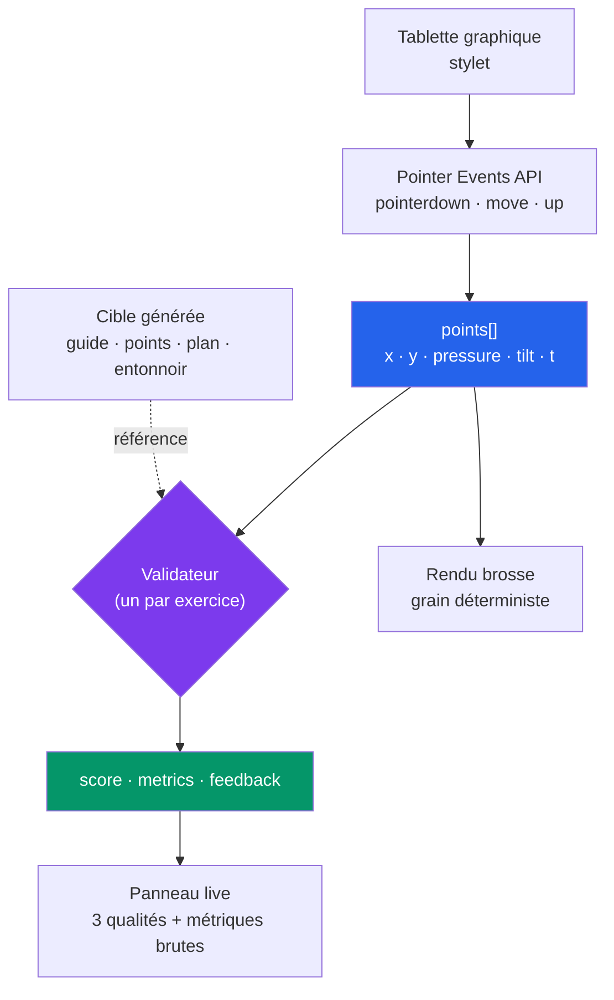

# ✏️ HowDrawaBox

> **Apprendre à dessiner avec un correcteur qui regarde ton geste, pas ton dessin.**
> Chaque point du trait est capturé — position, pression, inclinaison du stylet, horodatage —
> et évalué géométriquement pendant que tu traces. Basé sur le cursus [Drawabox](https://drawabox.com).


-blue)

---

## Le problème

Drawabox ne juge pas la ressemblance d'un dessin, il juge **la qualité du geste** : un trait
doit être tracé d'un mouvement franc, depuis l'épaule, sans s'arrêter pour corriger.

Or deux traits peuvent être **visuellement identiques** et pédagogiquement opposés :

```
Trait A  ▸ 180 ms, vitesse régulière, une seule passe        → geste confiant
Trait B  ▸ 2,4 s, trois ralentissements, un aller-retour     → geste hésitant
```

Une fois le dessin rendu en PNG, cette différence **a disparu**. C'est pour ça qu'un
correcteur qui analyse l'image finale ne peut structurellement pas enseigner Drawabox.

**Conséquence : le cœur du projet est la capture stroke-level**, pas le rendu.

> **Décision d'architecture :** canvas web custom plutôt que GIMP/Krita. Ces derniers
> n'exposent que l'image rendue, jamais la dynamique du geste.

## Comment ça marche



Le contrat de validation est le format pivot. Il est **agnostique de l'UI** : chaque
validateur est un module isolé, testable sans navigateur.

```js
// entrée : les points bruts du trait + la cible générée pour l'exercice
points[] = { x, y, pressure, tiltX, tiltY, t }

// sortie
{ score: 0..1, metrics: { …mesures brutes… }, feedback: [{ t, m }] }
```

## Ce que les validateurs mesurent

Sept modules d'analyse couvrent les 16 exercices du cursus :

| Module | Exercices | Mesures |
|---|---|---|
| `superimposed-lines` | Lignes superposées | Droiture (écart à la régression), *fraying* aux deux bouts, superposition des passages |
| `ghosted-lines` | Lignes fantômées | Erreur départ/arrivée sur la cible, arc, overshoot, wobble |
| `ghosted-planes` | Plans fantômés | Adhérence au guide, bord le plus raté |
| `ellipses-in-planes` | Ellipses en plans, tables d'ellipses | Régularité (écart au fit par moindres carrés), nombre de tours, écart aux 4 bords, degré |
| `funnels` | Entonnoirs | Alignement sur l'axe mineur, inscription dans les bornes |
| `markmaking` | Perspectives, boîtes, arêtes | Convergence vers le point de fuite, droiture, fluidité de l'arc |
| `ellipse-geometry` | — | Primitive partagée : fit d'ellipse, degré, fermeture |

Trois **signaux transverses** s'ajoutent à toutes les analyses, et ce sont eux qui
distinguent le trait A du trait B ci-dessus : `Vitesse`, `Stalls` (ralentissements),
`Reversals` (aller-retours).

Chaque trait ressort avec un score sur 100, trois qualités synthétiques, le détail des
métriques brutes repliable, et un feedback qui **nomme la faute** plutôt que de donner une note.

## Ce qui tourne aujourd'hui

- ✅ **16 exercices analysés en direct** — chacun avec sa cible générée et ses critères
- ✅ **45 tests** sur tracés synthétiques, 7 suites — chaque règle couverte par un tracé « bon » **et** un « mauvais »
- ✅ **5 brosses réellement distinctes** — plume (largeur suivant la pression), feutre, crayon, craie, aquarelle
- ✅ **Réglages figés par trait** — changer de brosse ne repeint jamais ce qui est déjà sur la page
- ✅ **Grain déterministe** — un PRNG semé rend chaque trait à l'identique à chaque frame, sinon il scintillerait au redraw
- ✅ **Gomme au trait entier**, taille (0.5→16) et opacité en jauges continues
- ✅ **Références flottantes** — photos et vidéos YouTube déplaçables, redimensionnables et **duplicables** (une vue figée sur une pose, l'autre qui tourne)
- ✅ **Progression persistée** — moyennes par exercice, verrouillage progressif des leçons
- ✅ **Bilingue FR / EN** avec repli automatique sur l'anglais

<!-- Captures d'écran : déposer les PNG dans docs/screenshots/ puis référencer ici -->

## Les cinq espaces

| | |
|---|---|
| **Cours** | Les 8 leçons du cursus, verrouillage progressif, échauffements tirés au sort dans les leçons 1-2 |
| **Challenges** | Les 5 séries longues (250 boîtes, 250 cylindres, 25 textures, 25 roues, 100 coffres) — isolées parce qu'elles s'intercalent au cursus au lieu de le suivre |
| **Exercices** | 16 exercices notés, imbriqués sous leur leçon |
| **Anatomie** | Vidéo de démo + canvas libre côte à côte, sans notation (contenu tiers) |
| **Dessin libre** | Page blanche, références déplaçables, aucun score |

## Stack

| | |
|---|---|
| **Capture** | Pointer Events API (`pressure`, `tiltX/Y`, `timeStamp`), `getCoalescedEvents()` pour ne perdre aucun point |
| **Analyse** | JavaScript pur — PCA, régression linéaire, fit d'ellipse par moindres carrés |
| **Rendu** | Canvas 2D, tracé segment par segment pour la largeur variable |
| **App** | Modules ES natifs, **zéro dépendance**, pas d'étape de build |
| **Dev** | `server.mjs` — statique, `Cache-Control: no-store` |

## Démarrage

Un serveur local est nécessaire : `file://` bloque `fetch` et les modules ES.

```bash
npm start     # node server.mjs → http://localhost:8000
```

Le serveur envoie `no-store` volontairement : les navigateurs mettent les modules ES en
cache très agressivement, et sans ça une modification de `src/` peut ne pas être reprise
au rechargement — on finit par déboguer du code périmé.

```bash
npm test      # 45 tests de validateurs, sans navigateur
```

## Structure

```
index.html              shell : Cours · Challenges · Pratique · Lecture
server.mjs              serveur statique de dev (no-store)

src/canvas/
  capture.js            Pointer Events → points[] bruts
  render.js             papier, cibles, 5 brosses (grain déterministe)

src/validators/         le cœur — un module = un critère, testable isolément
  geometry.js           primitives : PCA, régression, arc, wobble
  ellipse-geometry.js   fit d'ellipse, degré, fermeture
  superimposed-lines.js · ghosted-lines.js · ghosted-planes.js
  ellipses-in-planes.js · funnels.js · markmaking.js
  fixtures.js           tracés synthétiques (bons et mauvais)
  test.mjs              runner

src/content/
  loader.js             contenu + traductions FR + rendu markdown
  progress.js           progression persistée (localStorage)

src/ui/
  app.js                orchestration des vues, état outil, gomme
  modes.js              un mode par exercice : cible, qualités, métriques
  video.js              fenêtres vidéo flottantes (drag, resize, duplication)
  pip-manager.js        références photo/vidéo déplaçables
  styles.css            thèmes soft / dark / light
```

**Ajouter un exercice noté** = écrire un module de validation + une entrée dans `MODES`.
Le reste de l'écran est commun.

## Feuille de route

- [x] Capture stroke-level + validateur « lignes superposées » (preuve de l'approche)
- [x] Chargement du contenu → sélection d'exercice avec consigne et images
- [x] Validateurs ellipses, entonnoirs, plans, convergence en perspective
- [x] Échauffements tirés au sort, progression et verrouillage
- [x] Outil de dessin : brosses, gomme, références flottantes
- [ ] Calibration empirique des seuils sur des tracés réels annotés
- [ ] Feedback qualitatif par LLM en complément des règles géométriques
- [ ] Fit d'ellipse avancé en WASM/OpenCV si les moindres carrés atteignent leurs limites

## Contenu pédagogique

**Le corpus Drawabox n'est pas inclus dans ce dépôt.**

L'app lit son contenu depuis un `drawabox.json` accompagné de `lessons/`, `exercises/` et
`content-fr/`. Ces fichiers contiennent le texte intégral du cours — environ 106 000 mots —
qui reste la propriété de **Drawabox Art Instruction Inc.** Les republier ici reviendrait à
redistribuer le cours ; ils sont donc volontairement exclus (voir [`.gitignore`](.gitignore)).

Sans eux, l'app se lance et affiche un message d'erreur explicite à la place du parcours.
**Le moteur d'analyse, lui, est entièrement fonctionnel et testable** (`npm test`).

Le cours est gratuit et excellent — allez le lire à la source : **[drawabox.com](https://drawabox.com)**.

<details>
<summary>Schéma attendu de <code>drawabox.json</code></summary>

```jsonc
{ "source": "...", "scraped_at": "...", "lesson_count": 13,
  "exercises": [
    { "id": "...", "lesson": 1, "name": "superimposedlines",
      "title": "...", "url": "...", "images": [], "markdown": "..." }
  ],
  "lessons": [
    { "id": "1", "part": "part1", "part_name": "...", "title": "...",
      "exercises": [ { "id": "...", "title": "...", "url": "..." } ],
      "pages": [ { "page": 1, "section": "...", "images": [], "markdown": "..." } ] }
  ] }
```
</details>

## Notes

**Seuils à calibrer.** Les critères géométriques sont implémentés et testés, mais leurs
seuils restent empiriques. Un score n'est pas une évaluation officielle Drawabox : c'est
un indicateur de régularité du geste, à confronter au [feedback de la communauté](https://drawabox.com/lesson/0/2/critique).

**Crédits.** Cursus, texte pédagogique et images : **[Drawabox](https://drawabox.com)** —
© Drawabox Art Instruction Inc. Cours gratuit, soutenez-le.
Série « Anatomy Quick Tips » : **[Sinix Design](https://www.youtube.com/@sinixdesign)** —
lecture via l'embed YouTube officiel, contenu non redistribué.

Le code de l'application est sous [licence MIT](LICENSE) ; elle ne couvre pas le contenu
pédagogique. Projet personnel, sans but lucratif.
